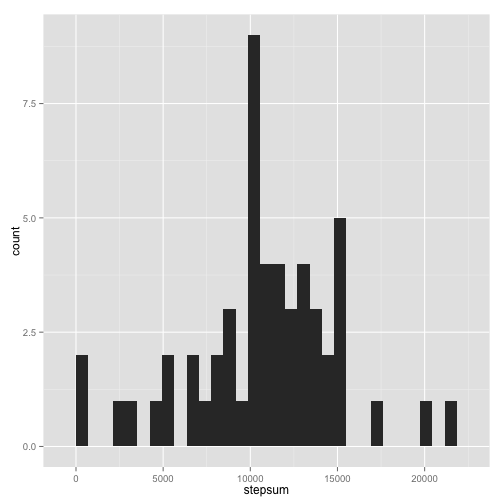
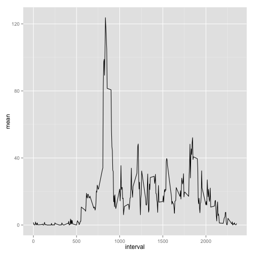
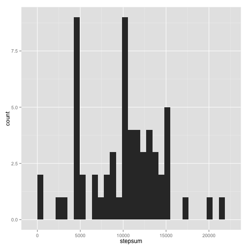
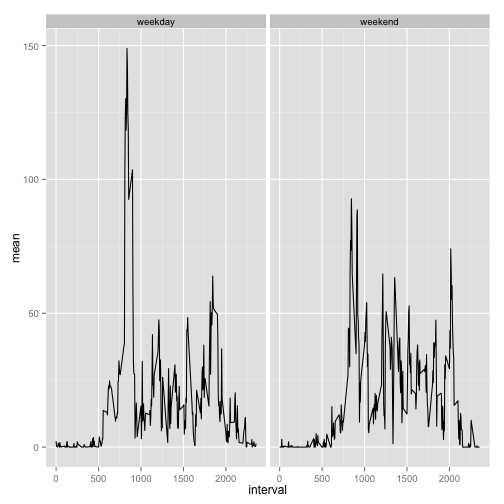

```r
require(data.table)
require(dplyr)
require(ggplot2)
```

## Loading and preprocessing the data

Load the data


```r
data <- fread("activity.csv")
```

Process/transform the data into a format suitable for analysis


```r
data$date <- as.Date(data$date)
```

## What is mean total number of steps taken per day?

Calculate the total number of steps taken per day


```r
datatotal <- data %>% group_by(date) %>% mutate(stepsum = (cumsum(steps)))
stepsday <- dplyr::filter(datatotal, interval == 2355)
```

Make a histogram of the total number of steps taken each day


```r
qplot(data = stepsday, x = stepsum, geom = "histogram")
```

 

Calculate and report the mean and median of the total number of steps taken per day


```r
rmean <- mean(stepsday[["stepsum"]], na.rm = "TRUE")
rmean
```

```
## [1] 10766.19
```

```r
rmed <- median(stepsday[["stepsum"]], na.rm = "TRUE")
rmed
```

```
## [1] 10765
```

The average number of steps taken per day is 1.0766189 &times; 10<sup>4</sup>. The median is 10765.

## What is the average daily activity pattern?

Make a time series plot of the 5-minute interval (x-axis) and the average number of steps taken, averaged across all days (y-axis)


```r
stepsint <- dplyr::filter(data, steps != "NA")
stepsint <- stepsint %>% group_by(interval) %>% mutate(stepsum = (cumsum(steps)))
stepsint <- dplyr::filter(stepsint, date == "2012-10-30")
stepsint <- stepsint %>% mutate(mean = stepsum/61)
stepsint <- ungroup(stepsint)
plot <- ggplot(data = stepsint, aes(x = interval, y = mean))
plot + geom_line()
```

 

Which 5-minute interval contains the maximum number of steps?


```r
stepsint <- dplyr::arrange(stepsint, mean)
rsteps <- stepsint$interval[288]
rsteps
```

```
## [1] 835
```

The interval 835 contains the maximum number of steps.

## Imputing missing values

Calculate and report the total number of rows with NAs


```r
missing <- dplyr::filter(data, is.na(steps))
rmis <- nrow(missing)
rmis
```

```
## [1] 2304
```

2304 rows are missing steps data.

Fill in all of the missing values in the dataset


```r
imp <- dplyr::left_join(data, stepsint, by = "interval")
imp <- dplyr::select(imp, interval, steps.x, date.x, mean)
imp <- within(imp, steps.x[is.na(steps.x)] <- mean[is.na(steps.x)])
```

Creating a new dataset with the missing data filled in


```r
imp <- dplyr::arrange(imp, date.x)
imp <- dplyr::select(imp, steps.x, date.x, interval)
imp <- dplyr::rename(imp, steps = steps.x, date = date.x)
```

Make a histogram of the total number of steps taken each day


```r
datatotalimp <- imp %>% group_by(date) %>% mutate(stepsum = (cumsum(steps)))
stepsdayimp <- dplyr::filter(datatotalimp, interval == 2355)
qplot(data = stepsdayimp, x = stepsum, geom = "histogram")
```

 

Calculate and report the mean and median total number of steps taken per day


```r
rmean <- mean(stepsdayimp[["stepsum"]])
rmean
```

```
## [1] 9993.707
```

```r
rmed <- median(stepsdayimp[["stepsum"]])
rmed
```

```
## [1] 10395
```

The average number of steps taken per day after imputation is 9993.707068. The median is 1.0395 &times; 10<sup>4</sup>.

### Do these values differ from the estimates from the first part of the assignment? What is the impact of imputing missing data on the estimates of the total daily number of steps?

Both values are lower than the values before imputation. The difference is larger for the mean than for the median. The histogram shows a whole new spike which seems to indicate that the imputation method chosen was not very appropriate for the data at hand. 

## Are there differences in activity patterns between weekdays and weekends?

Create a new factor variable in the dataset with two levels – “weekday” and “weekend” indicating whether a given date is a weekday or weekend day.


```r
imp <- imp %>% mutate(day = (as.factor(weekdays(date))))
levels(imp$day) <- c("weekday", "weekday", "weekday", "weekday", "weekday", "weekend", 
                     "weekend")
```

Make a panel plot containing a time series plot of the 5-minute interval (x-axis) and the average number of steps taken, averaged across all weekday days or weekend days (y-axis).


```r
stepsint2 <- imp %>% group_by(interval, day) %>% mutate(stepsum = (cumsum(steps)))
stepsint2 <- dplyr::filter(stepsint2, (date == "2012-10-30" | date == "2012-10-28"))
stepsint2 <- stepsint2 %>% group_by(day) %>% mutate(mean = stepsum/43)
stepsint2 <- stepsint2 %>% group_by(day) %>% mutate(meanwe = stepsum/18)
stepsint2 <- within(stepsint2, mean[day == "weekend"] <- meanwe[day == "weekend"])
stepsint2 <- ungroup(stepsint2)
plot2 <- ggplot(data = stepsint2, aes(x = interval, y = mean))
plot2 + geom_line() + facet_grid(.~day)
```

 


